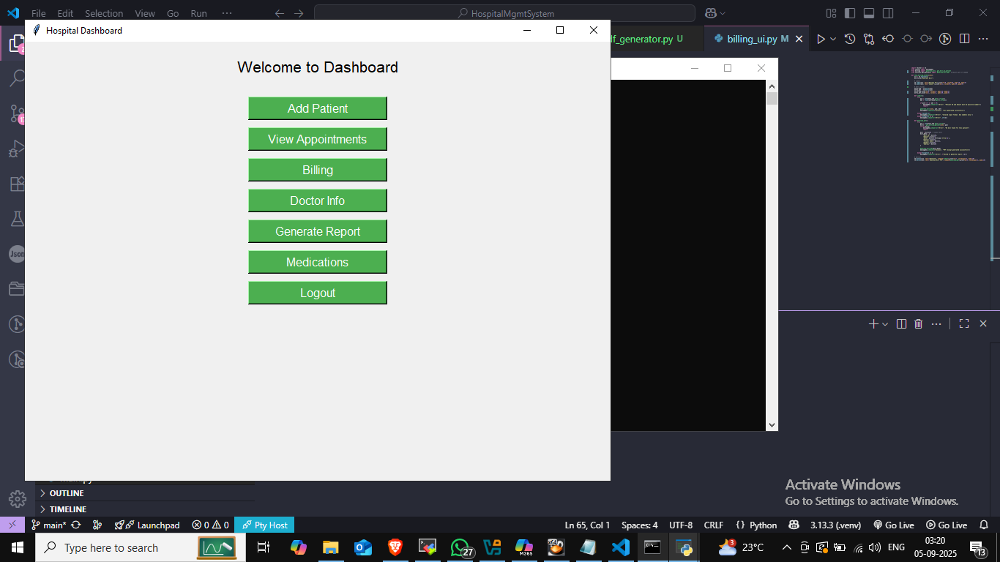
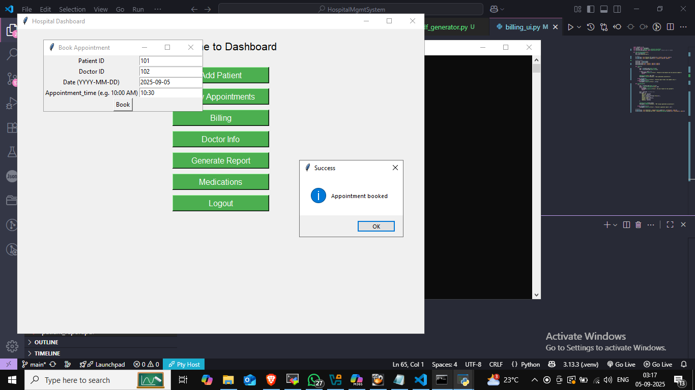
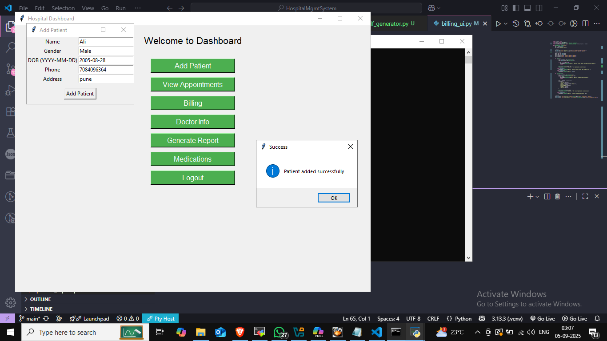
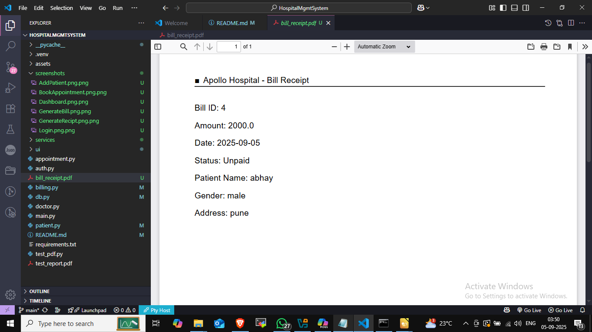

# 🏥 Hospital Management System

A full-featured desktop application built with Python and Oracle Database to streamline hospital operations — from patient registration to billing and PDF receipt generation.

---

## 🚀 Features

- 🔐 Role-based login system (admin, doctor, etc.)
- 🧑‍⚕️ Add and manage patient records
- 📅 Book and view appointments
- 💰 Generate bills with automatic timestamps
- 🧾 Download PDF receipts with patient details
- 💊 Track medications and doctor info
- 📊 Dashboard with modular navigation

---

## 🛠️ Tech Stack

| Layer        | Technology             |
|--------------|------------------------|
| Frontend     | Tkinter (Python GUI)   |
| Backend      | Python (modular files) |
| Database     | Oracle 21c             |
| PDF Engine   | ReportLab              |
| Auth System  | USERS table validation |

---

=======
## 📸 Screenshots

### 🔐 Login Page


### 🏥 Dashboard


### 🧑‍⚕️ Appointment


### 💰 Billing Module


### 🧑‍⚕️ Patient Details


### 🧾 Bill PDF Receipt


---

## 📂 Folder Structure
HospitalManagementSystem/ ├── main.py # Entry point for launching the app ├── dashboard.py # Main dashboard interface ├── welcome.py # Welcome screen logic ├── login_page.py # Login form and validation ├── appointment_ui.py # Appointment booking and viewing ├── billing_ui.py # Billing form and PDF download ├── patient_details.py # Patient info display and editing ├── doctor_login.py # Doctor login module ├── doctor_register.py # Doctor registration form ├── user_login.py # User login module ├── user_register.py # User registration form ├── register_user.py # Backend logic for user registration ├── report/ # Report generation and PDF templates │ ├── test_report.pdf # Sample generated report │ └── report_logic.py # PDF generation logic ├── services/ # Backend logic and helpers │ ├── billing.py # Bill generation and DB insert │ ├── patient.py # Patient record management │ ├── pdf_generator.py # PDF receipt creation using ReportLab ├── screenshots/ # UI screenshots for README │ ├── login_page.png │ ├── dashboard.png │ ├── billing_page.png │ ├── patient_details.png │ ├── bill_pdf.png ├── pycache/ # Python cache files (ignored) ├── .gitignore # Git ignore rules ├── README.md # Project documentation

---
## Requirements
- *Python 3.6+*
- *Oracle Instant Client*: [Download from Oracle](https://www.oracle.com/database/technologies/instant-client.html)
- *Oracle Database*: A running Oracle instance (can be local or remote).
- *Libraries*:
  - cx_Oracle - To connect to Oracle database.
  - tkinter - For the frontend UI.

## Setup Instructions

### 1. Install Oracle Instant Client
   - Follow the instructions to install [Oracle Instant Client](https://www.oracle.com/database/technologies/instant-client.html).

### 2. Install Dependencies
   - Install Python dependencies using:
     bash
     pip install -r requirements.txt
     

### 3. Configure Oracle Connection
   - Modify db_connection.py or the connection settings in register_ui.py to match your Oracle database credentials (username, password, hostname, port, and service name).

### 4. Run the Application
   - To run the user registration UI, use the following command:
     bash
     python register_ui.py
     
   - This will open a window where you can input a username, password, and email, and then register a new user into the database.

## Database Setup

The project assumes you have a table named users with the following schema:

```sql
CREATE TABLE users (
    user_id NUMBER GENERATED ALWAYS AS IDENTITY PRIMARY KEY,
    username VARCHAR2(100),
    password VARCHAR2(100),
    email VARCHAR2(100)
);